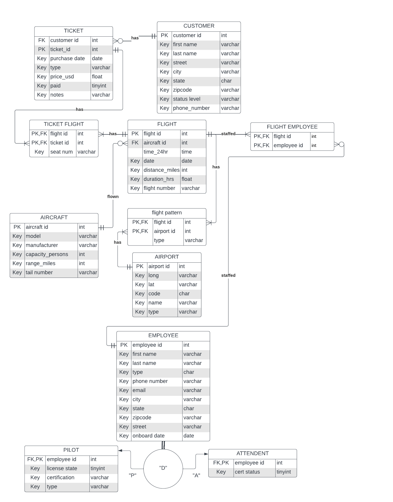

# Airline Database Management System  
**Final Project - CS195**  
**Date:** 12/04/2023  
**Prepared by:** Corbin Hastings & Nate Rengo  

## Project Overview  
This project is a **relational database system** built in **MySQL** for managing the operations of a fictional airline. It provides a structured and optimized way to store and track essential airline data, including flights, passengers, employees, aircraft, and ticketing.  


## Project Definition & Scope  
### Problem Statement  
The airline requires a **centralized database** to efficiently manage employees, passengers, flights, and ticket sales. This system provides:  
- **Reliable** data storage  
- **Efficient** query execution  
- **Improved** operational workflow  

### Users  
- **Airline Employees**: Managing flights, ticketing, and scheduling  
- **Analysts**: Extracting insights on performance and operations  

### Data Requirements  
The system stores data on:  
- **Employees** (pilots, attendants)  
- **Customers** (passenger profiles)  
- **Aircraft** (fleet details)  
- **Flights** (schedules, routes)  
- **Tickets** (purchases, seat assignments)  
- **Airports** (origin/destination details)  

---

##  Conceptual Design  
### Entity-Relationship Diagram (ERD)  



## Installation & Setup  
1. Clone the repository:  
   ```bash
   git clone https://github.com/your-username/airline-database.git
   cd airline-database
   ```
2. Import the database:  
   ```sql
   SOURCE airline_database.sql;
   ```
3. (Optional) Run backend server:  
   ```bash
   python app.py  # Flask
   node server.js  # Node.js
   ```

---

## Contributors  
- **Corbin Hastings**  
- **Nate Rengo**  

---
